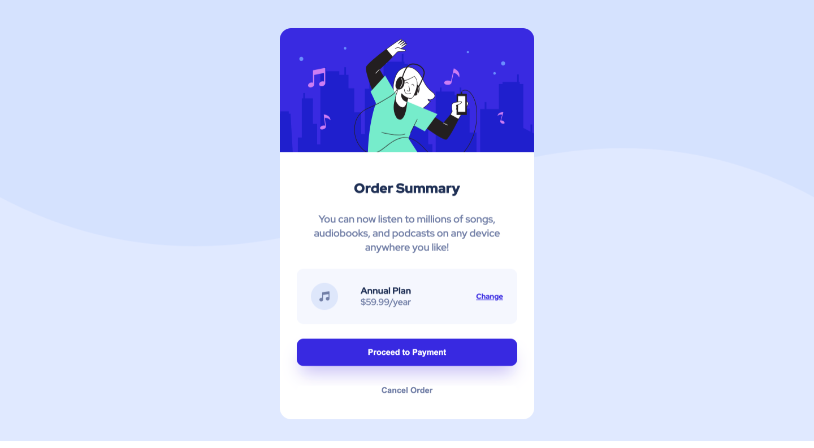

# Frontend Mentor - Order summary card solution

This is a solution to
the [Order summary card challenge on Frontend Mentor](https://www.frontendmentor.io/challenges/order-summary-component-QlPmajDUj).
Frontend Mentor challenges help you improve your coding skills by building realistic projects.

## Table of contents

- [Overview](#overview)
    - [The challenge](#the-challenge)
    - [Screenshot](#screenshot)
    - [Links](#links)
- [My process](#my-process)
    - [Built with](#built-with)
    - [What I learned](#what-i-learned)
    - [Useful resources](#useful-resources)
- [Author](#author)

## Overview

I wanted to continue to practice my frontend skills without any CSS frameworks.

### The challenge

Users should be able to:

- See hover states for interactive elements
- Make the Mobile Design look like the design

### Screenshot

#### Desktop



#### Mobile


### Links

- Solution URL: [Github](https://github.com/JosephLord215/Frontend-Mentor-Order-summary-component)
- Live Site URL: [Here](https://josephlord215.github.io/Frontend-Mentor-Order-summary-component/)

## My process

### Built with

- Semantic HTML5 markup
- CSS custom properties
- Flexbox

### What I learned

A skill I'm taking from this project is that you can set Flex to multiple items in a flex container.

```html

<div class="container">
    <div class="payment-section"></div>
</div>
```

```css
.container {
    display: flex;
    flex-direction: column;
    justify-content: center;
    text-align: center;
    padding: 30px;
    font-size: 18px;
}

.payment-section {
    font-size: 16px;
    background-color: var(--very-pale-blue);
    padding: 25px;
    border-radius: 12px;
    display: flex;
    flex-direction: row;
    justify-content: space-between;
    align-items: center;
}
```

### Useful resources

- [W3Schools](https://www.w3schools.com/css/) - Helped me for brush up on Responsive Design.

- [HTML / CSS Tutorial – Create an Order Summary Component Youtube](https://www.youtube.com/watch?v=SR5GxoFhIAU&t=141s) -
  Used this to help me with the payment section of this challenge.

## Author

- GitHub - [JosephLord215](https://github.com/JosephLord215)
- Frontend Mentor - [JosephLord215](https://www.frontendmentor.io/profile/JosephLord215)


